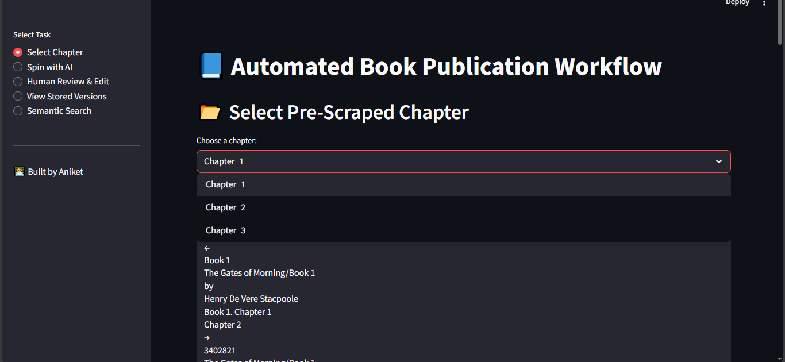

# 📘 Automated Book Publication Workflow  
**An intelligent, end-to-end platform for scraping, rewriting, reviewing, and storing book content using AI agents and human feedback.**

---

## 🚀 Project Overview

This project automates the process of extracting book content from online sources, rewriting it with LLMs, refining it with human input, and storing it for future retrieval and versioning using ChromaDB.

It was built as part of an AI internship challenge to demonstrate AI agent collaboration, human-in-the-loop refinement, and real-world document automation using modern tools.

---
## 🎯 Objective
 Create a system to fetch content from a web URL, apply an AI-driven "spin" to book chapters, and allow multiple human-in-the-loop iterations for editing and finalization.

 
---

## 🧠 Features

- 🌐 **Web Scraping + Screenshots** using Playwright  
- ✍️ **AI-Driven Chapter Rewriting** with LangChain & GROQ  
- 👨‍💻 **Human Review & Edit Interface** in Streamlit  
- 🧠 **Semantic Search** using Sentence Transformers + RL scoring  
- 🧾 **Version Control** with ChromaDB  
- 📂 **Readable Version History** and clean UI

---

## 📂 Project Structure


---

## 📸 Screenshots

| Scrape Chapter | AI Rewrite | Review & Edit |
|----------------|------------|---------------|
|  |  |  |

| View Versions | Semantic Search |
|---------------|------------------|
|  |  |

> Screenshots are located in the `project_screenshot/` folder.

---

## 🛠️ Tech Stack

- `streamlit` – UI interface  
- `playwright` – Headless browser for scraping + screenshots  
- `beautifulsoup4` – HTML content extraction  
- `langchain + langchain-groq` – LLM orchestration  
- `chromadb` – Vector DB for versioning and search  
- `sentence-transformers` – Semantic embeddings  
- `scikit-learn + joblib` – Lightweight RL scoring model  
- `python-dotenv` – Secure API key handling

---

## 💻 How to Run Locally

1. **Clone the repository:**
   ```bash
   git clone https://github.com/jasoncobra3/Automated_Book_Publication_Workflow.git
   cd Automated_Book_Publication_Workflow'
2. **Create a Virtual Environment:**
   ```bash
   python -m venv venv
   source venv/bin/activate  # or venv\\Scripts\\activate (Windows)
3. **Install dependencies:**
   ```bash
   pip install -r requirements.txt
   playwright install  # Install browser binaries

4. **Create a **.env** file based on .env.example:**
   ```bash
    GROQ_API_KEY=your_groq_api_key

5. **Run the App:**
   ```bash
    streamlit run app.py

---

Feel free to reach out for feedback, collaboration, or just to connect:
- 🔗 [Aniket_Nerkar_gihtub](https://github.com/jasoncobra3)


